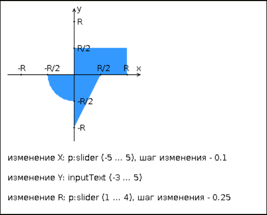

<!-- Here is the main logo and name of your project -->

<p align="center">
  <a href="https://github.com/worthant/interactive-graph-ui">
    <picture>
      
    </picture>
    <h1 align="center">
        Interactive graph UI
        <a aria-label="Перевод" href="./README_RU.md">
            
        </a>
    </h1>   
  </a>
</p>

<!-- Here are some cool labels for your project, delete those, that you don't need -->

<p align="center">
   <a aria-label="WildFly Version" href="https://www.wildfly.org/">
      
   </a>
   <a aria-label="Java" href="https://www.jetbrains.com/">
      
   </a>
   <a aria-label="Maven Project" href="https://maven.apache.org/">
      
   </a>
   <a aria-label="JavaServer Faces Framework" href="https://www.oracle.com/java/technologies/javaserverfaces.html">
      
   </a>
   <a aria-label="Tailwind CSS Version" href="https://tailwindcss.com/">
      
   </a>
</p>

<details open>
   <summary><b>Table of Contents</b></summary>

- [Demonstration](#demo)
- [Description](#descr)
- [Technical Requirements](#requirements)
- [Topics for Theoretical Defense](#defense)
- [How to use my project](#user-manual)
- [Theoretical Materials](#theoretical-materials)

</details>

<a id="demo"></a>

## Demonstration 🎥

| Youtube video |
|------------------------|
|https://youtu.be/ny15aofvGCI|

<a id="descr"></a>

## Description 📝

> 👋 **Welcome to this laboratory project!**
>
> 🛠 **What is it?**  
> This is a modern web application built on the `JavaServer Faces` framework. Its architecture uses `2 facelets templates` for flexibility and modularity. The starting page provides general information and redirects to the main page with functionality. Server logic is implemented using `Managed Beans`, ensuring flexible and scalable data processing.
>
> 🎯 **The goal of the site**  
> To make the process of entering coordinates of points and checking their hit in a given area as convenient and intuitive as possible. My `UI` was developed with a focus on good `UX` 😎
>
> ---
>
> 📌 **Main features**
>
> - 🖥 **Interactive Data Entry**: Use intuitive interface elements to enter coordinates.
> - 📊 **Dynamic Graph**: Visualization of the area and points on the coordinate plane in real-time.
> - 🔒 **Server-Side Validation**: Reliable verification of entered data is ensured through Managed Beans.
>
> ---
>
> 🚀 **Want to know more?** [Check out the user manual](#user-manual) and dive into the amazing world of this web application! 💻

<a id="requirements"></a>

## Technical Requirements

||
|-----------------------------|

### Goal: Develop a web application based on the JavaServer Faces Framework

#### 📋 Main parts of the application

- [x] `Managed Beans`: Managed beans that contain server-side data processing logic.
- [x] `index.xhtml`: The starting page containing general information and redirecting to the main page.
- [x] `main.xhtml`: The main application page with a web form for entering coordinates and displaying results.

#### 🎨 The `index.xhtml` start page should include

1. [x] Header: Full name, group number, variant number.
2. [x] Interactive Clock: Shows the current date and time, updates every 10 seconds.
3. [x] Link: allows you to go to the main page of the application.

#### 📊 The main `main.xhtml` page should include

1. [x] A set of components: To set the coordinates of the point and the radius of the area according to the task variant. The use of additional component libraries may be required - [ICEfaces](http://www.icesoft.org/java/projects/ICEfaces/overview.jsf) (prefix "ace") and [PrimeFaces](http://www.primefaces.org/) (prefix "p").
    - [x] Form: Sends data to the server via Managed Beans.
    - [x] A set of fields: For setting the coordinates of the point and the radius of the area.
2. [x] Validation: JavaScript- or JSF-validation of entered data.
3. [x] 🟠 Interactive Element:
    - [x] Dynamic visualization of results on the graph.
    - [x] Graph update after each request.
    - [x] An adaptive graph that changes its state depending on the selected radius.
    - [x] The color of the points should depend on the fact of hitting/not hitting the area.
4. [x] Results: A table with the results of previous checks, stored in a Managed Bean.
5. [x] A link that allows you to return to the start page.

#### Additional requirements for the application:

- [x] All verification results must be stored in a PostgreSQL-managed database.
- [x] Access to the DB must use the ORM EclipseLink.
- [x] A Session-scoped Managed Bean should be used to manage the list of results.
- [x] The configuration of managed beans should be set using parameters in the configuration file.
- [x] The rules of navigation between the pages of the application should be defined in a separate configuration file.

#### 🌐 Deployment

- [x] The developed web application must be deployed on the `WildFly` server in standalone configuration, ports must be configured in accordance with the issued `portbase`, access to the http listener must be open to all IPs.

<a id="defense"></a>

## Topics for preparation for laboratory defense

1. [x] `JavaServer Faces` technology. Features, differences from `servlets` and `JSP`, advantages and disadvantages. Structure of a JSF application.
2. [x] Using `JSP pages` and `Facelets templates` in JSF applications.
3. [x] `JSF components` - implementation features, class hierarchy. Additional component libraries. The `event processing model` in JSF applications.
4. [x] Data converters and validators.
5. [x] Presentation of the `JSF` page on the `server side`. UIViewRoot class.
6. [x] `Managed beans` - purpose, configuration methods. Managed beans context.
7. [x] Configuration of JSF applications. The faces-config.xml file. FacesServlet class.
8. [x] Navigation in JSF applications.
9. [x] Access to the DB from Java applications. `JDBC` protocol, query formation, working with DBMS drivers.
10. [x] `ORM concept`. ORM libraries in Java applications. Main APIs. Integration of ORM providers with JDBC drivers.
11. [x] ORM libraries `Hibernate` and `EclipseLink`. Features, API, similarities and differences.
12. [x] `JPA technology`. Features, API, integration with ORM providers.

<a id="user-manual"></a>

## How to use my project

### Docker

> [!TIP]
> For a quick setup to view the project (not suitable for profiling for the OPI course and Docker is not available on Helios)

```bash
git clone git@github.com:worthant/interactive-graph-ui.git
cd interactive-graph-ui
mvn clean package
docker-compose up --build
```

Connect in browser:

```bash
http://localhost:32318/interactive-graph-ui-1.0-SNAPSHOT/
```

### Manual setup (for helios mainly)

> [!NOTE]
> I've included a fully functional standalone.xml config in the resources - you can check it out as an example and use it for the project.

1. Follow all the steps from [my guide](https://github.com/worthant/web3-jsf-eclipselink-template/)
2. Don't forget to create a database in studs:

> Connect with `psql -h pg -d studs`

```sql
CREATE TABLE point_model {
  id SERIAL PRIMARY KEY,
  x DOUBLE PRECISION NOT NULL,
  y DOUBLE PRECISION NOT NULL,
  r DOUBLE PRECISION NOT NULL
}
```

3. Also, don't forget to forward the ports:

```bash
ssh -L port:localhost:port sXXXXXX@se.ifmo.ru -p 2222
```

4. Done, go to the browser and enter:

```bash
http://localhost:port/interactive-graph-ui-1.0-SNAPSHOT/
```

<a id="theory"></a>

## Theoretical materials

1. **JavaServer Faces**: [Official JSF documentation](https://docs.oracle.com/javaee/7/javaserver-faces-2-2/vdldocs-facelets/index.html)
2. **ORM EclipseLink**: [EclipseLink documentation](https://www.eclipse.org/eclipselink/documentation/)
3. **Lecture from se.ifmo**: [internet.pdf](https://se.ifmo.ru/~s367837/internet.pdf)
4. **Sergei Nazemtsev's theory**: [theory.md](https://github.com/web-labs/Web-Lab-3/blob/main/theory.md)
1. **ACID-transactions**: [habr](https://habr.com/ru/articles/555920/)
1. **JSF Lifecycle**: [java-online](https://java-online.ru/jsf-lifecycle.xhtml)
1. **Lombok**: [complete guide](https://auth0.com/blog/a-complete-guide-to-lombok/)
1. **CSS Battle**: [css is fun!)](https://cssbattle.dev/)
1. **Responsive CSS**: [vk - HASH](https://vk.com/wall-46465252_58953)
5. **Tailwind CSS**: [tw](https://tailwindcss.com/)
6. **Tailwind Components**: [for error pages and beautiful buttons](https://tailwindcomponents.com/)
